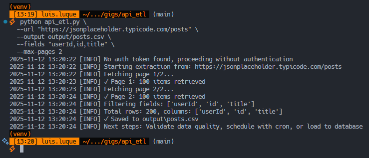
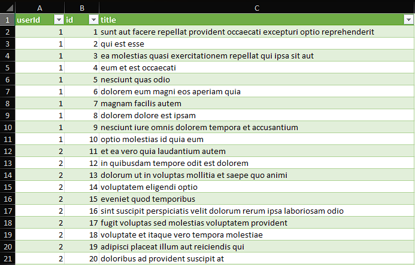

# API ETL Tool

[Español (README.es.md)](README.es.md)

Extract data from paginated REST APIs to CSV/XLSX with authentication, field filtering, and automatic rate limiting.

**Key features:**

- Handles paginated endpoints with configurable page parameter
- Bearer token authentication via environment variables
- Field filtering to reduce output size
- Automatic retry on rate limit (HTTP 429)
- Support for additional query parameters

## Install

```bash
python -m venv .venv && source .venv/bin/activate
# On Windows: .venv\Scripts\activate
pip install -r requirements.txt
```

## Quick demo with public API

```bash
# No authentication needed for this demo
python api_etl.py \
  --url "https://jsonplaceholder.typicode.com/posts" \
  --output output/posts.csv \
  --fields "userId,id,title" \
  --max-pages 2
```

**Expected output:**

- `posts.csv` with 20 rows (10 per page) and 3 columns
- Terminal logs showing pagination progress with timestamps

**Run all demos:**

```bash
cd examples
bash demo_public_api.sh
```

## Usage with authentication

For APIs requiring authentication:

```bash
# 1. Copy environment template
cp .env.example .env

# 2. Edit .env and add your token
# API_TOKEN=your_actual_token_here

# 3. Run extraction
python api_etl.py \
  --url "https://api.example.com/data" \
  --output output/data.xlsx \
  --max-pages 5 \
  --token-env API_TOKEN
```

## Parameters

```bash
python api_etl.py --help
```

**Required:**

- `--url`: API endpoint URL
- `--output`: Output file (`.csv` or `.xlsx`)

**Optional:**

- `--fields`: Comma-separated fields to extract (default: all fields)
- `--max-pages`: Number of pages to fetch (default: 1)
- `--page-param`: Pagination parameter name (default: `page`)
- `--params`: Additional query params as JSON string
- `--token-env`: Environment variable name for auth token (default: `API_TOKEN`)
- `--auth-header`: Authorization header name (default: `Authorization`)
- `--sleep`: Seconds between requests (default: 0.5)

## Common examples

### GitHub API (public repos)

```bash
python api_etl.py \
  --url "https://api.github.com/users/torvalds/repos" \
  --output output/torvalds_repos.csv \
  --fields "name,stargazers_count,language,updated_at" \
  --max-pages 1
```

### API with custom pagination

```bash
python api_etl.py \
  --url "https://api.example.com/records" \
  --output output/records.xlsx \
  --page-param "offset" \
  --params '{"limit":50,"status":"active"}' \
  --max-pages 10
```

### With authentication and rate limiting

```bash
# Set API_TOKEN in .env file first
python api_etl.py \
  --url "https://api.private.com/data" \
  --output output/data.csv \
  --max-pages 20 \
  --sleep 1.0 \
  --token-env API_TOKEN
```

## Screenshots

### Terminal output during extraction



### Result preview (CSV opened in spreadsheet)



## How it works

1. **Authentication**: Loads token from `.env` file using `python-dotenv`
2. **Pagination**: Automatically increments page parameter for each request
3. **Rate limiting**: Waits between requests; retries on HTTP 429
4. **Field filtering**: Extracts only specified fields from JSON responses
5. **Export**: Converts to pandas DataFrame and saves as CSV/XLSX

## Response format support

The tool handles two common API response structures:

**Array response:**

```json
[
	{"id": 1, "name": "Item 1"},
	{"id": 2, "name": "Item 2"}
]
```

**Object with items key:**

```json
{
	"items": [{"id": 1, "name": "Item 1"}],
	"total": 100
}
```

## Tech Stack

- **Python 3.9+**
- **pandas** - Data manipulation and export
- **requests** - HTTP client with retry logic
- **python-dotenv** - Environment variable management
- **openpyxl** - Excel file writing

## Next steps

After extraction, you can:

- Load to database (PostgreSQL, MySQL)
- Schedule with cron for daily updates
- Add data validation and quality checks
- Integrate with data pipelines (Airflow, Prefect)
